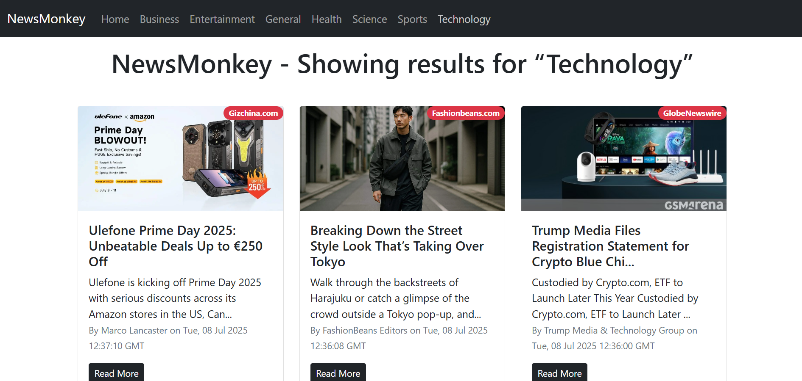
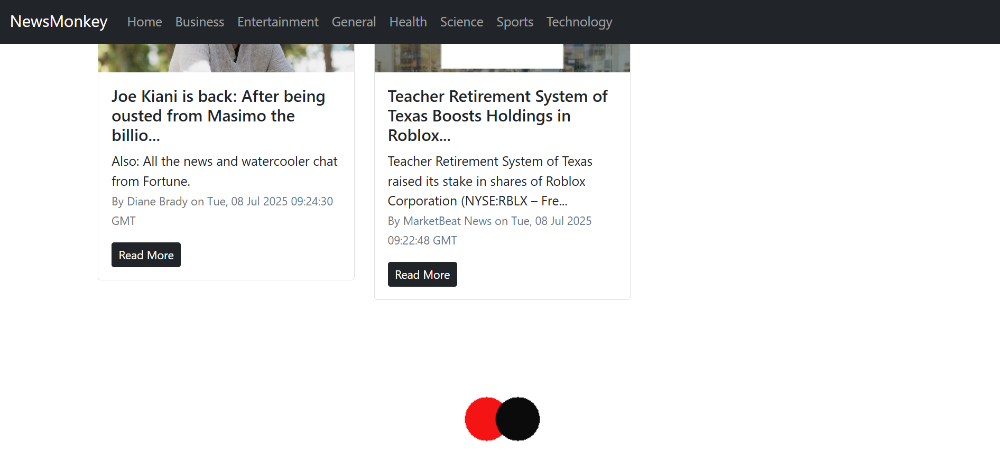

# 📰 News App – Real-time News Aggregator

A responsive and modern web app built with **React.js** that fetches live news articles using **NewsAPI**. The application supports infinite scrolling and category-based browsing for a seamless user experience.

---

## 🚀 Features

- 🗞️ Pulls real-time news using the [NewsAPI](https://newsapi.org/)
- 📱 Fully responsive layout using **Bootstrap**
- 🔄 Infinite scrolling for dynamic content loading
- 🧭 Category-based navigation (e.g., business, sports, technology)
- 🌐 Opens articles in a new tab
- 📅 Displays publish date and source

---

## 🛠️ Tech Stack

- **React.js** – Component-based UI
- **NewsAPI** – External REST API for news data
- **Bootstrap 5** – Responsive design and layout
- **HTML5 & CSS3**

---

## 🚀 Live Demo

🌐 [Click here to view the live project](https://smith-droid.github.io/news-app)

---

## 📸 Screenshots

### 🏠 Homepage

### 🧠 Technology Category

### 🔄 Infinite Scroll in Action

### 📱 Mobile View

---

## 📚 What I Learned

- Fetching external API data in React
- Managing component state and lifecycle
- Handling asynchronous loading (infinite scroll)
- Styling and layout with Bootstrap in React apps

---

## 🙋‍♂️ Author

- **Name**: Smith Popat
- **GitHub**: [Smith-droid](https://github.com/Smith-droid)
